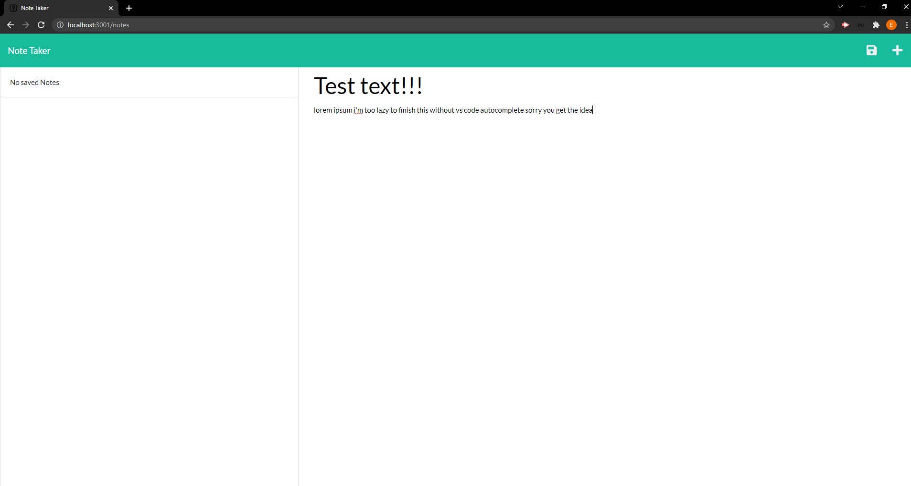
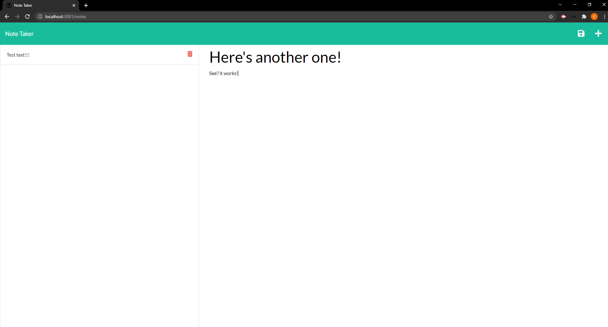

# EXPRESS NOTE TAKER

## This project is a Note Taker application for busy folks with bad memories.

# TECHNOLOGIES USED 
## This application is built with Express.js, Node.js, JavaScript, HTML, and CSS.

---

# USAGE
## The user can start their Express.js server by running "heroku open." This will open the page in the browser from the command line.. 

```
WHEN I type my note, I am presented with a "save" icon in the page header.
WHEN I save my note, my note is saved on the left-hand column of the page.
IF I click on a saved note, it will populate the right-hand column of the page for me to read.
WHEN I click the "+" button in the page header, my viewed note is cleared and I am presented with an empty text box to enter a new note.
WHEN I click the "Delete" button next to a saved note, that note is removed from the list of saved notes.
```

# SCREENSHOTS


---



# LINK TO DEPLOYED APPLICATION
## https://evening-chamber-46130.herokuapp.com/

---